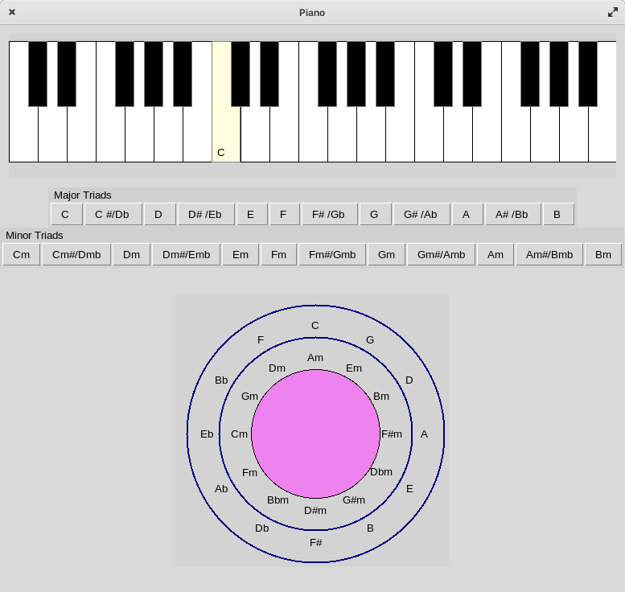

install python3 and pip3
<pre>sudo apt install python3 python3-tk python3-pip </pre>

install fluidsynth 
<pre>sudo apt install fluidsynth fluidsynth-soundfont-gm </pre>

install  pyfluidsynth with pip 3!!! NO SUDO (No upgrade...):
<pre>pip3 install pyfluidsynth </pre>

run with python
<pre>python3 mainpiano.py </pre>
 

No sound ? Test fluidsynth with a mid file
<pre>fluidsynth -a pulseaudio /usr/share/sounds/sf2/FluidR3_GM.sf2 mymusicfile.mid </pre>

 

